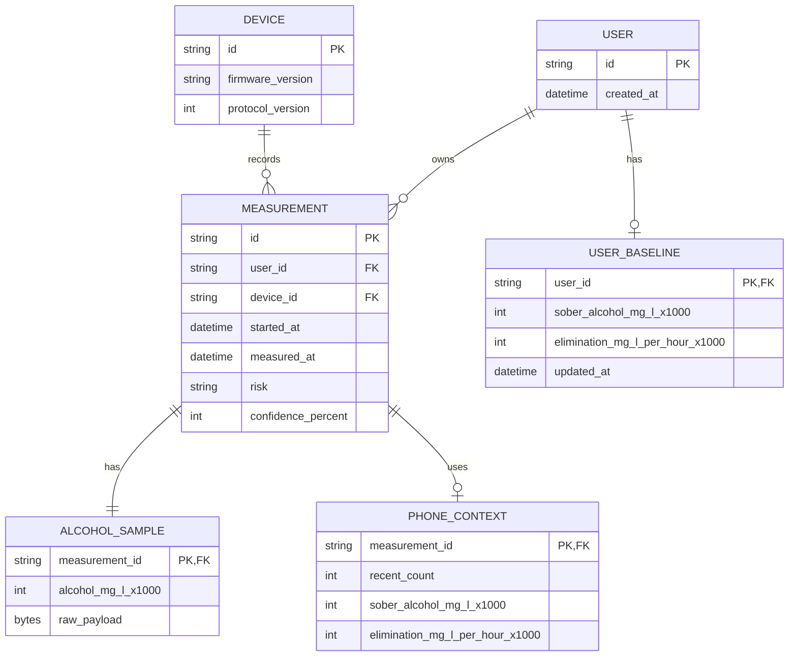

# Drunksafe Measurement Model

현재 모델링 원칙은 단순하다.

- 센서별 세부 모델은 각 feature 안에 둔다.
- BLE는 transport envelope 역할만 한다.
- 간단한 동작은 `feature::action()` 형태의 한 단어 함수로 노출한다.
- 확정되지 않은 데이터는 BLE 공통 모델에 미리 넣지 않는다.

## Alcohol Feature

위치: `firmware/src/feature/alchol/`

공개 액션:

- `alchol::init(transport)`: ZE29 모듈 상태를 조회하고 device handle을 만든다.
- `alchol::sample(&mut device)`: `0x86` read test results 명령으로 현재 알코올 샘플을 읽는다.
- `alchol::status(&mut device)`: `0x85` query module status 명령으로 모듈 상태를 읽는다.

구조:

- `command`: ZE29 명령 코드
- `protocol`: 9 byte request/response frame과 checksum
- `transport`: UART 등 실제 I/O 추상화
- `model`: `Sample`, `Status`, `Concentration`, raw response

SOLID 관점:

- `protocol`은 frame encode/decode만 담당한다.
- `transport`는 I/O만 담당한다.
- `model`은 도메인 데이터만 담당한다.
- `Device<T>`는 transport trait에만 의존하므로 실제 UART, mock, buffered transport로 쉽게 교체할 수 있다.

## ZE29 Protocol

공식 매뉴얼 기준:

- UART: 9600 baud, 8 data bits, 1 stop bit, parity/check byte 없음
- Frame length: 9 bytes
- Start byte: `0xFF`
- Module address: `0x01`
- Integer byte order: high byte first
- Checksum: `-(data1 + data2 + ... + data7)`의 8 bit two's complement

명령 코드:

| Command | Meaning |
|---------|---------|
| `0x85` | Query module status |
| `0x86` | Read test results |
| `0x87` | Switch module working status |
| `0x88` | Read blow time |
| `0x89` | Set blowing time |
| `0x90` | Read drinking threshold |
| `0x91` | Set drunk threshold |
| `0x92` | Read blow pressure threshold |
| `0x93` | Set blow pressure threshold |

참고 자료:

- Winsen ZE29A-C2H5OH product page: https://www.winsen-sensor.com/sensors/alcohol-sensor/ze29a-c2h5oh.html
- Winsen ZE29A-C2H5OH manual: https://www.winsen-sensor.com/d/files/ze29a-alcohol-module-manualv1_0.pdf

## BLE Model

위치: `firmware/src/feature/ble/model.rs`

BLE 모델은 다음 정도만 가진다.

- `Session`: 보드 버튼으로 새 측정 세션을 열고, 앱에 필요한 히스토리 개수와 시간 동기화 여부를 요청한다.
- `Context`: 앱이 최근 히스토리와 개인화에 필요한 최소 필드만 보낸다.
- `Progress`: 측정 진행 상태와 percent만 전달한다.
- `Report`: 최종 측정 결과를 전달한다. 알코올 상세 값은 `alchol::Sample`을 그대로 참조한다.

BLE 모델이 직접 소유하지 않는 것:

- ZE29 raw frame 해석 규칙
- MAX30102 raw/PPG 모델
- 앱 히스토리 DB schema
- 장기 추천/상담 모델

## Context From Phone

현재 알코올 측정에 필요한 최소 context:

| Field | Purpose |
|-------|---------|
| `phone_time_unix_ms` | 결과 timestamp 기준 |
| `recent` | 최근 측정값으로 해독 추세와 이상치 판단 |
| `sober_alcohol_mg_l_x1000` | 0 근처 baseline 판단 |
| `elimination_mg_l_per_hour_x1000` | 개인화된 sober-time 계산 |

MAX30102 모델은 별도 feature가 생길 때 `pulse` 같은 모듈로 분리하고, BLE `Report`가 해당 feature 모델을 optional로 참조하게 확장한다.

## ERD

