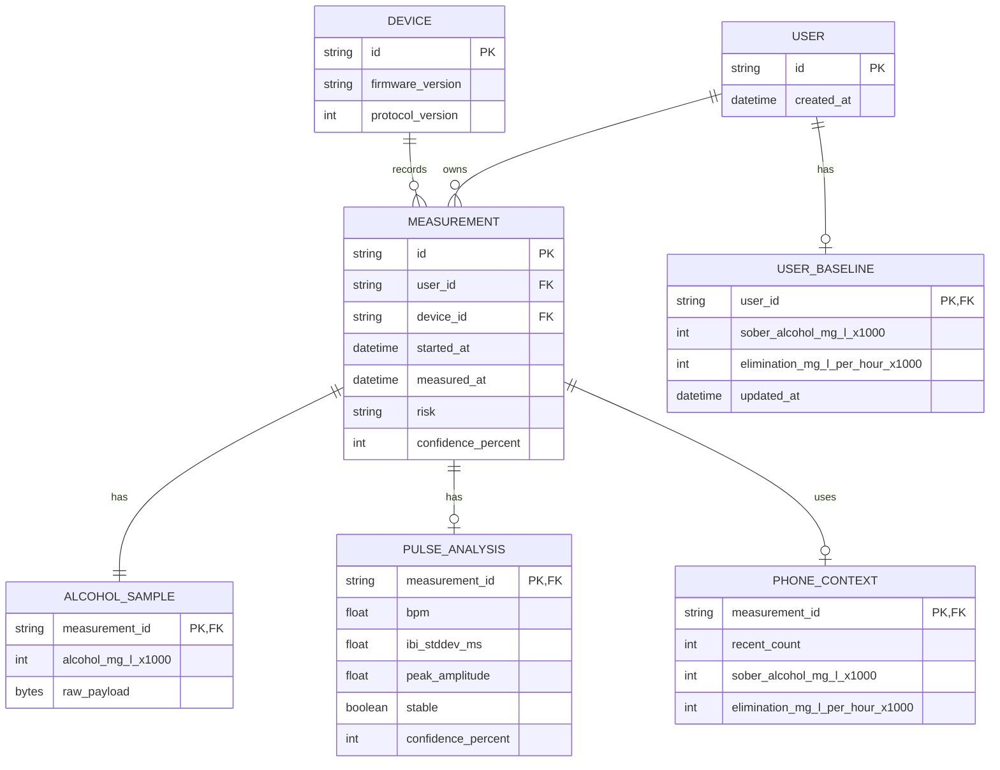

# Drunksafe Measurement Model

현재 모델링 원칙은 단순하다.

- 센서별 세부 모델은 `devices` 안에 둔다.
- BLE는 transport envelope 역할만 한다.
- 간단한 동작은 소유 모듈에서 한 단어 함수로 노출한다.
- 확정되지 않은 데이터는 BLE 공통 모델에 미리 넣지 않는다.
- `main.rs`는 logger와 device를 초기화한 뒤 runtime loop를 직접 닫아 가진다.
- 보드 배선은 `devices::init()`이 소유하고, 각 device는 custom transport나 핀 tuple이 아니라 concrete HAL driver를 받는다.
- 현재 runtime은 단일 루프이므로 device state는 plain mutable state로 유지한다. task/thread 공유가 실제로 필요해지는 시점에만 shared state를 도입한다.
- 측정 세션 sequence는 `main.rs`의 runtime loop가 로컬 상태로 소유한다. BLE 모델에는 transport DTO만 둔다.
- snapshot은 필요할 때 사용처에서 각 device를 직접 호출한다. 별도 `Snapshot` 집계 모델은 두지 않는다.

## Trigger Device

위치: `firmware/src/devices/trigger/`

공개 액션:

- `TriggerDevice::new(pin)`: BOOT 버튼 GPIO0를 input pull-up으로 설정한다.
- `trigger.pressed()`: 버튼이 새로 눌린 순간에만 `true`를 반환한다.

버튼 trigger는 테스트용 입력이다. 프로덕션 흐름은 주기적 pulse 측정 중 위험 신호가 확인되면 디스플레이와 BLE를 통해 알코올 측정 필요 알림을 보내는 방향으로 확장한다.

## Alcohol Device

위치: `firmware/src/devices/alcohol/`

공개 액션:

- `AlcoholDevice::new(uart, tx, rx)`: `devices::init()`이 구성한 9600 8N1 UART와 TX/RX 핀을 ZE29 device handle로 감싼다.
- `device.test()`: `0x86` read test results 명령으로 현재 알코올 농도를 읽는다.
- `device.status()`: `0x85` query module status 명령으로 모듈 상태 코드를 읽는다.
- `device.work(wake)`: `0x87` switch module working status 명령으로 센서 모듈의 wake 상태를 전환한다. 공개 매뉴얼의 payload 정의가 상세하지 않아 현재 firmware에서는 `true`를 `0x01`, `false`를 `0x00`으로 캡슐화한다.

구조:

- `command`: ZE29 명령 코드와 command별 request payload factory
- `protocol`: 9 byte request/response frame
- `checksum`: ZE29 checksum 생성과 검증
- `channel`: async UART request/response 처리
- `status`: 모듈 상태 코드 모델
- `error`: alcohol device 전용 오류 타입

SOLID 관점:

- `protocol`은 frame encode/decode만 담당한다.
- `channel`은 UART I/O와 timeout만 담당한다.
- `ResponseFrame`은 command별 response struct를 만들지 않고 공통 payload 해석을 담당한다.
- `AlcoholDevice`는 concrete `UartDriver`를 소유하므로 ZE29 read/write 호출과 frame 처리 책임이 alcohol device 안에 머문다.
- UART peripheral/TX/RX 핀 배선과 baudrate 설정은 `devices::init()`에서 관리한다.

## Pulse Device

위치: `firmware/src/devices/pulse/`

공개 액션:

- `PulseDevice::new(adc, pin)`: `devices::init()`이 구성한 ADC1/GPIO36 입력과 pulse algorithm state를 묶는다.
- `device.reset()`: 새 측정 세션 시작 시 filter와 sample buffer를 초기화한다.
- `device.sample(elapsed_ms)`: GPIO36에서 PPG ADC 값을 읽고 5초 분석 주기마다 optional analysis를 반환한다.
- `device.analyze()`: 마지막 analysis를 조회한다.

`origin/modules`와 `origin/modules-fixed`의 `ppg_processor.py`는 동일하다. 적용 기준은 더 명시적인 `origin/modules-fixed`로 둔다. 핵심은 100Hz PPG 입력에 대한 0.7-3.5Hz 2차 Butterworth band-pass streaming filter, 10초 시작 지연 후 5초마다 분석, peak threshold 50, 최소 peak distance 300ms, IBI 표준편차 200ms 초과 시 불안정 처리, 20초/1분/5분 이동평균 feature다. peak distance 충돌은 더 큰 peak를 남기고, sample cadence jitter는 warning으로만 기록한다. 세션이 바뀔 때는 `device.reset()`을 먼저 호출한다.

구조:

- `params`: sampling cadence, warm-up, peak threshold, trend window 같은 튜닝 값
- `algorithm`: peak detection, IBI/BPM/stability 계산
- `filter`: origin/modules-fixed 기준 Butterworth streaming filter
- `state`: filter, sample window, moving average, last analysis
- `services`: ADC PPG sample read, algorithm state handle
- `crate::utils::math`: 평균, 표준편차, 반올림 같은 순수 유틸리티

## ZE29 Protocol

공식 매뉴얼 기준:

- UART: 9600 baud, 8 data bits, 1 stop bit, parity/check byte 없음
- Frame length: 9 bytes
- Start byte: `0xFF`
- Module address: `0x01`
- Integer byte order: high byte first
- Checksum: `-(data1 + data2 + ... + data7)`의 8 bit two's complement

명령 코드:

| Command | Meaning |
|---------|---------|
| `0x85` | Query module status |
| `0x86` | Read test results |
| `0x87` | Switch module working status |
| `0x88` | Read blow time |
| `0x89` | Set blowing time |
| `0x90` | Read drinking threshold |
| `0x91` | Set drunk threshold |
| `0x92` | Read blow pressure threshold |
| `0x93` | Set blow pressure threshold |

참고 자료:

- Winsen ZE29A-C2H5OH product page: https://www.winsen-sensor.com/sensors/alcohol-sensor/ze29a-c2h5oh.html
- Winsen ZE29A-C2H5OH manual: https://www.winsen-sensor.com/d/files/ze29a-alcohol-module-manualv1_0.pdf

## BLE Model

위치: `../firmware/src/services/ble/model.rs`

공개 액션:

- `ble::measurement_started(session_id)`: 보드 버튼으로 시작된 측정 세션 이벤트 DTO를 만든다.

GATT transport 계약:

| Name | UUID | Direction |
|------|------|-----------|
| Drunksafe service | `6f5f3f7a-3b0d-4df7-9d17-151b71e12201` | app discovers device service |
| Device event characteristic | `6f5f3f7a-3b0d-4df7-9d17-151b71e12202` | device notifies JSON `DeviceEvent` |
| Phone command characteristic | `6f5f3f7a-3b0d-4df7-9d17-151b71e12203` | app writes JSON `PhoneCommand` |

Characteristic value는 UTF-8 JSON 문자열을 base64로 감싼다. `react-native-ble-plx`가 characteristic value를 base64로 주고받기 때문에 앱의 `app/src/lib/ble/codec.ts`는 JSON 문자열과 BLE base64 value 사이만 변환한다.

작은 payload는 `PhoneCommand`/`DeviceEvent` JSON을 그대로 한 번에 보낸다. `PhoneContext`처럼 `180 bytes`를 넘는 payload는 transport frame으로 나눠 보낸다.

| Frame | Direction | Fields |
|-------|-----------|--------|
| `phone_command_chunk` | app -> device | `id`, `index`, `count`, `data` |
| `device_event_chunk` | device -> app | `id`, `index`, `count`, `data` |

수신자는 같은 `id`의 chunk를 `index` 순서대로 합친 뒤 원래 JSON DTO validator를 통과시켜야 한다. 이 chunk frame은 BLE transport framing일 뿐이며, domain DTO에는 넣지 않는다.

BLE 모델은 다음 정도만 가진다.

- `DeviceStatus`: 연결 직후와 runtime 상태 변경 시 장치 상태를 전달한다.
- `MeasurementStarted`: 보드 또는 앱에서 새 측정 세션을 열고, 필요한 히스토리 개수와 시간 동기화 여부를 요청한다.
- `PhoneContext`: 앱이 최근 히스토리와 개인화에 필요한 파생 context만 보낸다.
- `MeasurementProgress`: 측정 진행 단계와 percent만 전달한다.
- `MeasurementResult`: 최종 측정 결과를 전달한다. BLE에는 `Alcohol`, `Pulse` 요약 DTO만 싣고 raw frame이나 알고리즘 내부 필드는 노출하지 않는다.
- `DeviceError`: 앱이 조치할 수 있는 오류 코드를 전달한다.

BLE 모델이 직접 소유하지 않는 것:

- ZE29 raw frame 해석 규칙
- PPG raw/algorithm 세부 구현
- 앱 히스토리 DB schema
- 장기 추천/상담 모델

## Context From Phone

현재 알코올 측정에 필요한 최소 context:

| Field | Purpose |
|-------|---------|
| `phone_time_unix_ms` | 결과 timestamp 기준 |
| `recent` | 최근 측정값으로 해독 추세와 이상치 판단 |
| `sober_alcohol_mg_l_x1000` | 0 근처 baseline 판단 |
| `sober_alcohol_mad_mg_l_x1000` | sober baseline 신뢰 범위 |
| `elimination_mg_l_per_hour_x1000` | 개인화된 sober-time 계산 |
| `resting_bpm` | pulse 보조 신뢰도 판단 |

Pulse 분석 모델은 `PulseDevice`가 소유하고, BLE `MeasurementResult`는 해당 device 모델을 optional로 참조한다.

## ERD

