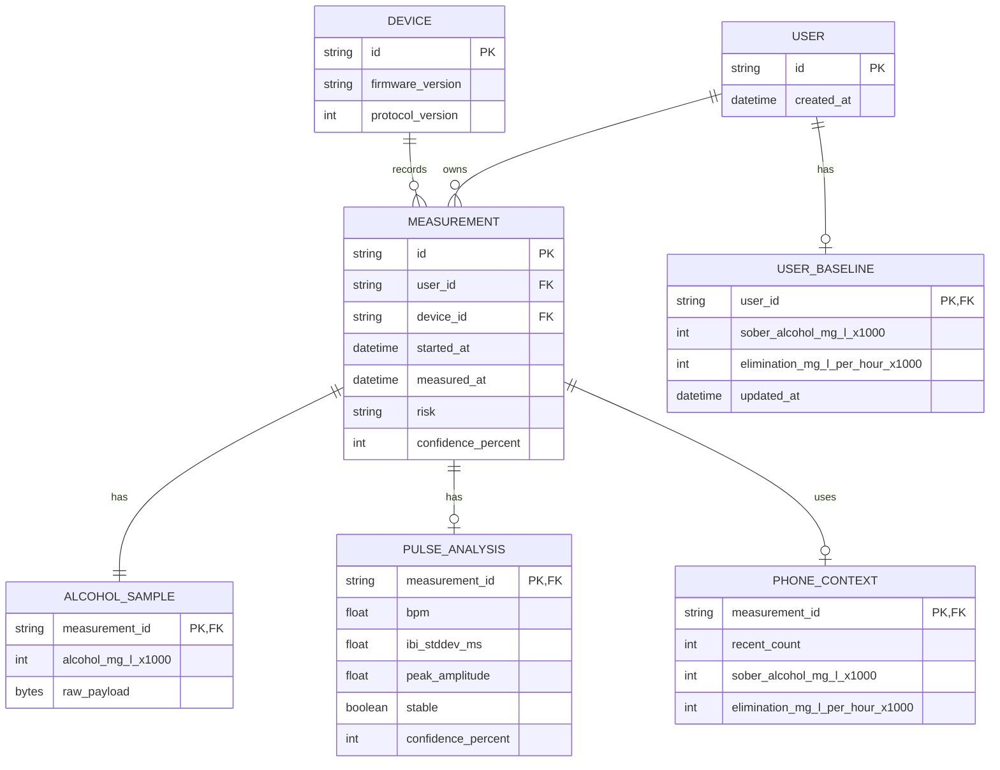

# Drunksafe Measurement Model

현재 모델링 원칙은 단순하다.

- 센서별 세부 모델은 각 feature 안에 둔다.
- BLE는 transport envelope 역할만 한다.
- 간단한 동작은 `feature::action()` 형태의 한 단어 함수로 노출한다.
- 확정되지 않은 데이터는 BLE 공통 모델에 미리 넣지 않는다.
- `main.rs`는 logger 초기화 후 `feature::run()`만 호출한다.
- `feature::run()`은 peripherals 획득, feature state 생성, runtime loop를 닫아 가진다.
- 현재 runtime은 단일 루프이므로 feature state는 plain mutable state로 유지한다. task/thread 공유가 실제로 필요해지는 시점에만 shared state를 도입한다.
- 측정 세션 sequence는 `feature::run()`의 runtime loop가 로컬 상태로 소유한다. BLE 모델에는 transport DTO만 둔다.
- snapshot은 필요할 때 사용처에서 각 feature를 직접 호출한다. `feature::Snapshot` 같은 집계 모델은 두지 않는다.

## Trigger Feature

위치: `firmware/src/feature/trigger/`

공개 액션:

- `trigger::init(pin)`: BOOT 버튼 GPIO를 input pull-up으로 설정하고 trigger state를 만든다.
- `trigger::poll(&mut state)`: debounce state machine을 진행하고 측정 시작 이벤트를 optional로 반환한다.

버튼은 지금은 유일한 측정 시작 입력이지만, 앱 시작/자동 재측정 같은 입력이 생기면 trigger feature가 event source를 확장한다.
`poll()`은 블로킹하지 않으므로 같은 runtime loop에 BLE context 수신이나 센서 tick을 추가할 수 있다.

## Alcohol Feature

위치: `firmware/src/feature/alcohol/`

공개 액션:

- `alcohol::Device::attach(transport)`: ZE29 transport를 device handle로 감싸고 초기 status를 조회한다.
- `device.sample()`: `0x86` read test results 명령으로 현재 알코올 샘플을 읽는다.
- `device.status()`: `0x85` query module status 명령으로 모듈 상태를 읽는다.

구조:

- `command`: ZE29 명령 코드
- `protocol`: 9 byte request/response frame과 checksum
- `transport`: UART 등 실제 I/O 추상화
- `model`: `Sample`, `Status`, `Concentration`, raw response

SOLID 관점:

- `protocol`은 frame encode/decode만 담당한다.
- `transport`는 I/O만 담당한다.
- `model`은 도메인 데이터만 담당한다.
- `Device<T>`는 transport trait에만 의존하므로 실제 UART, mock, buffered transport로 쉽게 교체할 수 있다.
- `Transport::read()`는 timeout을 인터페이스에 포함하므로 실제 UART 구현도 block-free 계약을 지켜야 한다.

## Pulse Feature

위치: `firmware/src/feature/pulse/`

공개 액션:

- `pulse::State::default()`: pulse feature state를 만든다.
- `pulse::reset(&mut state)`: 새 측정 세션 시작 시 filter와 sample buffer를 초기화한다.
- `pulse::sample(&mut state, elapsed_ms, raw_12bit)`: MAX30102 raw PPG 값을 스트리밍 Butterworth 필터에 통과시키고 5초 분석 주기마다 optional analysis를 반환한다.
- `pulse::analyze(&state)`: 마지막 analysis를 조회한다.

`origin/modules`와 `origin/modules-fixed`의 `ppg_processor.py`는 동일하다. 적용 기준은 더 명시적인 `origin/modules-fixed`로 둔다. 핵심은 100Hz PPG 입력에 대한 0.7-3.5Hz 2차 Butterworth band-pass streaming filter, 10초 시작 지연 후 5초마다 분석, peak threshold 50, 최소 peak distance 300ms, IBI 표준편차 200ms 초과 시 불안정 처리, 20초/1분/5분 이동평균 feature다. peak distance 충돌은 더 큰 peak를 남기고, sample cadence jitter는 warning으로만 기록한다. 세션이 바뀔 때는 `pulse::reset()`을 먼저 호출한다.

구조:

- `params`: sampling cadence, warm-up, peak threshold, trend window 같은 튜닝 값
- `algorithm`: peak detection, IBI/BPM/stability 계산
- `filter`: origin/modules-fixed 기준 Butterworth streaming filter
- `state`: filter, sample window, moving average, last analysis
- `crate::utils::math`: 평균, 표준편차, 반올림 같은 순수 유틸리티

## ZE29 Protocol

공식 매뉴얼 기준:

- UART: 9600 baud, 8 data bits, 1 stop bit, parity/check byte 없음
- Frame length: 9 bytes
- Start byte: `0xFF`
- Module address: `0x01`
- Integer byte order: high byte first
- Checksum: `-(data1 + data2 + ... + data7)`의 8 bit two's complement

명령 코드:

| Command | Meaning |
|---------|---------|
| `0x85` | Query module status |
| `0x86` | Read test results |
| `0x87` | Switch module working status |
| `0x88` | Read blow time |
| `0x89` | Set blowing time |
| `0x90` | Read drinking threshold |
| `0x91` | Set drunk threshold |
| `0x92` | Read blow pressure threshold |
| `0x93` | Set blow pressure threshold |

참고 자료:

- Winsen ZE29A-C2H5OH product page: https://www.winsen-sensor.com/sensors/alcohol-sensor/ze29a-c2h5oh.html
- Winsen ZE29A-C2H5OH manual: https://www.winsen-sensor.com/d/files/ze29a-alcohol-module-manualv1_0.pdf

## BLE Model

위치: `firmware/src/feature/ble/model.rs`

공개 액션:

- `ble::session(session_id)`: 보드 버튼으로 시작된 측정 세션 요청 DTO를 만든다.

BLE 모델은 다음 정도만 가진다.

- `Session`: 보드 버튼으로 새 측정 세션을 열고, 앱에 필요한 히스토리 개수와 시간 동기화 여부를 요청한다.
- `Context`: 앱이 최근 히스토리와 개인화에 필요한 최소 필드만 보낸다.
- `Progress`: 측정 진행 상태와 percent만 전달한다.
- `Report`: 최종 측정 결과를 전달한다. BLE에는 `Alcohol`, `Pulse` 요약 DTO만 싣고 raw frame이나 알고리즘 내부 필드는 노출하지 않는다.

BLE 모델이 직접 소유하지 않는 것:

- ZE29 raw frame 해석 규칙
- MAX30102 raw/PPG 알고리즘 세부 구현
- 앱 히스토리 DB schema
- 장기 추천/상담 모델

## Context From Phone

현재 알코올 측정에 필요한 최소 context:

| Field | Purpose |
|-------|---------|
| `phone_time_unix_ms` | 결과 timestamp 기준 |
| `recent` | 최근 측정값으로 해독 추세와 이상치 판단 |
| `sober_alcohol_mg_l_x1000` | 0 근처 baseline 판단 |
| `elimination_mg_l_per_hour_x1000` | 개인화된 sober-time 계산 |

MAX30102 모델은 `pulse` feature가 소유하고, BLE `Report`는 해당 feature 모델을 optional로 참조한다.

## ERD

