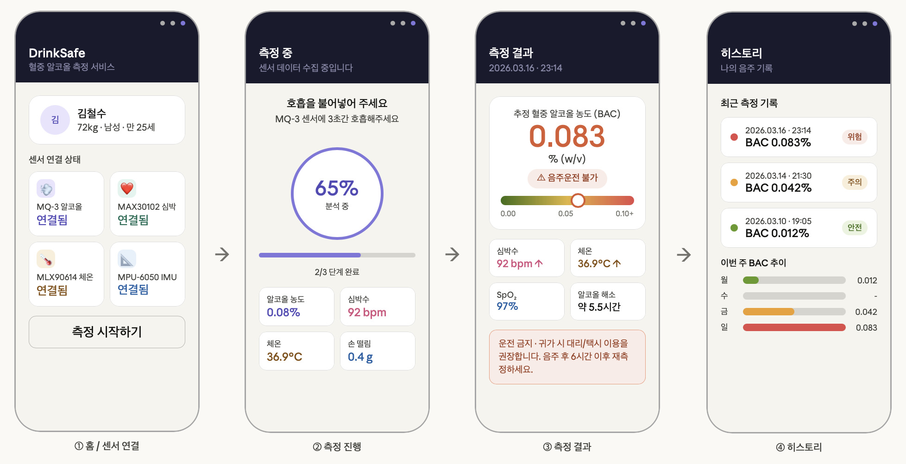
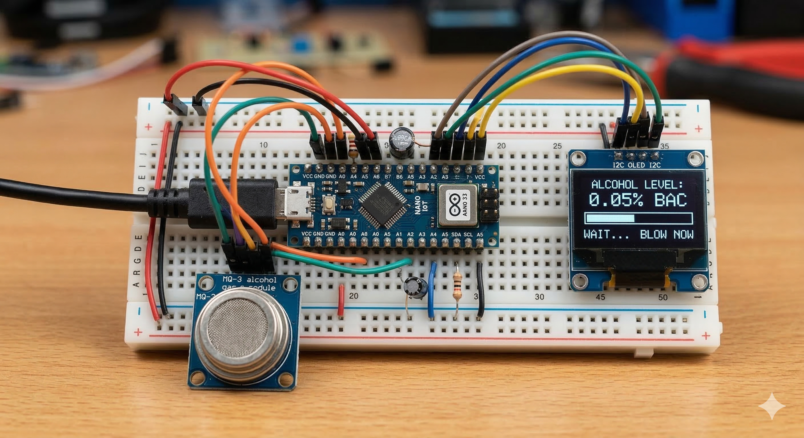
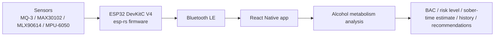

# Drunksafe

개인 맞춤형 알코올 분해 능력 분석 및 음주 사고 예방 시스템.

## 목표

2025년 보건복지부 중독 주요 지표 기준으로 국내 알코올 사용 장애 1년 유병률은 약 2.6%로 제시되어 있으며, 실제 치료를 희망하는 비율은 낮은 편입니다. Drunksafe는 사용자가 자신의 음주 상태를
객관적인 수치와 기록으로 확인하게 하여 음주운전, 숙취운전, 장비 운용 중 사고 같은 위험을 줄이는 것을 목표로 합니다.

핵심 목표는 다음과 같습니다.

- 센서 기반으로 알코올 농도와 보조 생체/상태 데이터를 측정합니다.
- 모바일 앱에서 실시간 측정 진행, 결과, 위험도, 히스토리를 제공합니다.
- 누적 측정값으로 개인별 알코올 분해 경향을 분석합니다.
- 과음 또는 잦은 음주 패턴에는 절주 콘텐츠, 상담/클리닉 등 개선 정보를 추천합니다.

## 예시 화면

원본 문서에 포함된 화면 흐름 목업입니다. React Native로 구현합니다.



원본 문서에 포함된 하드웨어 프로토타입 이미지입니다. 최종 구현 보드는 **ESP32 DevKitC V4**입니다.



## 기능

| 영역      | 기능                                                                       |
|-----------|----------------------------------------------------------------------------|
| 센서 연결 | MQ-3 알코올 센서와 보조 센서의 연결 상태를 앱에서 확인                     |
| 측정 진행 | 사용자가 호흡 측정을 시작하면 진행률과 수집 중인 센서 값을 표시            |
| 결과 분석 | BAC 추정값, 위험 단계, 심박수, 체온, 산소포화도, 손 떨림 등 보조 지표 표시 |
| 해독 예상 | 개인 분해 능력과 현재 측정값을 기반으로 해독 예상 시간 제공                |
| 히스토리  | 최근 측정 기록과 주간 추이 저장 및 표시                                    |
| 개선 안내 | 고위험 패턴 사용자에게 절주 콘텐츠, 상담 기관, 클리닉 정보 추천            |

## 아키텍처



서버를 전제로 하지 않는 구조입니다. 센서 디바이스가 Bluetooth LE로 앱에 데이터를 보내고, 앱은 측정 결과와 히스토리를 사용자 중심으로 표시합니다.

## 기술 스택

| Layer                      | Stack                                          |
|----------------------------|------------------------------------------------|
| Firmware target            | ESP32 DevKitC V4, classic ESP32                |
| Firmware language          | Rust 2021                                      |
| Firmware runtime           | esp-rs, ESP-IDF, `esp-idf-svc`, `embassy-time` |
| Firmware build direction   | PlatformIO + esp-rs                            |
| Current firmware bootstrap | Cargo + espup + espflash                       |
| Mobile app                 | React Native 0.85, Expo 56, Expo Router        |
| Mobile language            | TypeScript                                     |
| Mobile styling             | NativeWind, Tailwind CSS                       |
| Mobile BLE                 | `react-native-ble-plx`                         |
| Package manager            | pnpm                                           |

## 레포지터리 구성

```text
.
├── app/        # React Native / Expo 모바일 어플리케이션
├── firmware/   # ESP32 DevKitC V4 Rust 펌웨어
├── .docs/      # 문서 및 자료
└── README.md
```

## 프로젝트 계획

한이음 드림업 문서 기준 프로젝트 수행 기간은 **2026.04.01 ~ 2026.10.30**이며, 예상 팀원은 5명, 예상 난이도는 중입니다.

추진 단계는 다음과 같습니다.

| 단계   | 주요 작업                                                           |
|--------|---------------------------------------------------------------------|
| 계획   | 프로젝트 범위 정의, 위험 요소 정리, 센서/디바이스 요구사항 도출     |
| 분석   | 알코올 농도 데이터 흐름, 사용자 시나리오, 안전 안내 문구 분석       |
| 설계   | BLE 프로토콜, 앱 화면 흐름, 로컬 데이터 모델, 펌웨어 모듈 구조 설계 |
| 개발   | ESP32 펌웨어, React Native 앱, 센서 연결 및 측정 결과 화면 구현     |
| 테스트 | 센서 보정, BLE 연결 안정성, 결과 표시, 히스토리 저장 검증           |
| 마무리 | 시연 준비, 문서화, 앱 등록 및 공모전 제출 준비                      |
