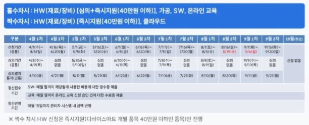

# 🛠️ 프로젝트 부품 신청 리스트

> **💡 주의사항**
> * 해외배송 최대 150달러
> * 신청시 한 차시당 최대 30개 품목
> * 한이음에 신청 후 멘토의 승인 받아야함
> * **수령인 통관번호 기재 요**

| 번호 | 품명 | 옵션 (상세) | 수량 | 필요성 및 활용계획 | 구입처 URL | 단가(VAT 포함) | 배송 |
| :---: | :--- | :--- | :---: | :--- | :--- | :---: | :---: |
| 1 | Arduino Nano ESP32 with headers | | 5 | 메인 제어 보드 | https://www.devicemart.co.kr/goods/view?no=15139451 | 27,390 |  |
| 2 | 아두이노 진동 모터 모듈 |  | 5 | 알림 역할 |https://www.devicemart.co.kr/goods/view?no=1386053 | 4,510 |  |
| 3 | 압력 센서 | | 5 | 컵 홀더 술잔 체크 | https://www.devicemart.co.kr/goods/view?no=1327467 | 7,502 | |
| 4 | ESP32-C3 SuperMini |  | 5 | 컵 홀더 통신용 | https://www.devicemart.co.kr/goods/view?no=15193221 | 8,690 |
| 5 | 심박 센서 |  | 5 | 심박수 측정을 통한 위험도 측정 | https://www.devicemart.co.kr/goods/view?no=1327434 | 2,640 |
| 6 | GSR 센서 | | 5 | 피부 전류 변화 측정 | https://www.devicemart.co.kr/goods/view?no=1289992 | 12,100 | 해외배송 |
| 7 | 음주측정기 | ALC-2(정확한 전문가용), MP6000(50개) | 1 | 측정 데이터 타당성 확인용 장비 | https://smartstore.naver.com/alcoscan/products/4549708463?nl-ts-pid=jlFsudqWjGYx2ssd4Hl-462770&n_media=11068&n_query=%EC%9D%8C%EC%A3%BC%EC%B8%A1%EC%A0%95%EA%B8%B0&n_rank=1&n_ad_group=grp-a001-02-000000011651351&n_ad=nad-a001-02-000000067517721&n_campaign_type=2&n_mall_id=ncp_1ns1th_01&n_mall_pid=4549708463&n_ad_group_type=2&n_match=3&nl-au=b438409304644d50ad9cb80fbb591488&NaPm=ct%3Dmp9swtlg%7Cci%3DERee4969c5%2D51f2%2D11f1%2D9598%2D661c287b6218%7Ctr%3Dpla%7Chk%3D34d96b11653194ea64a9febb9362c02353576d10%7Cnacn%3DfD5BDoBah4adB | 162,250 | 무료배송 |
| 8 | 알코올 센서 |  | 5 | 직접적인 알코올 농도 측정 | https://www.devicemart.co.kr/goods/view?no=1383953 | 6,160 |  |
| 9 | 저항 키트 |  | 2 | mq-3 전압 분배 및 압력 센서 저항 사용 | https://www.devicemart.co.kr/goods/view?no=1381629 | 1,980  *행사 전 가격 | 
| 10 | 전원 모듈 |  | 5 | 배터리 ups 모듈 | https://www.devicemart.co.kr/goods/view?no=16006626 | 4,950 | 해외배송 |
| 11 | 필라멘트 | 색상:슬렌더 핑크 | 1 | 프로토타입 외관 제작용 | https://smartstore.naver.com/kexcelled/products/8101837111?NaPm=ct%3Dmp9ukxew%7Cci%3Dd0f5b5cb1f37a18997940eeefdb18716ccf9ffef%7Ctr%3Dslsl%7Csn%3D6463524%7Chk%3D66b34a16b7b048653aa588a0f47633790e18e42b&nl-au=1a8e27b838a740c791b7dc957640350b&nl-query=3d+%ED%94%84%EB%A6%B0%ED%84%B0%ED%95%84%EB%9D%BC%EB%A9%98%ED%8A%B8 | 19,800 | 3,000 국내배송비

---

### - 묶음배송적용예정, 배송비 없음
- 해외배송 비용 아슬아슬하게 걸려서 **Arduino Nano ESP32 with headers** 선정함
- 배터리 선정, 측정방식에 따른 스위치 선정, 디스플레이 선정, 신체와 결합할 tie? 선정, etc..  

  

### - 부품 신청 일정 
 
  

