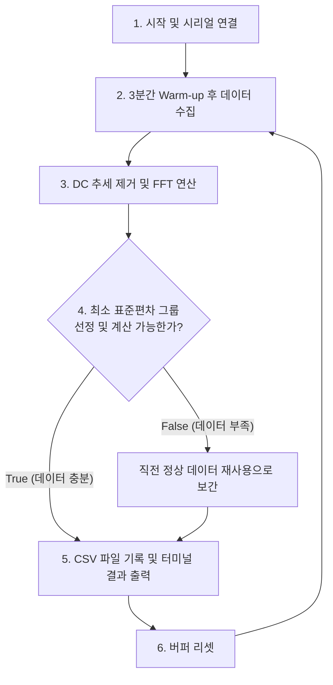

# 6/24~28 진행상황

- esp32/arduino uno단에서 ppg센서 측정값 취득 후 python에서 계산 수행
- 3D 프린팅 임시 구조물 제작 및 ppg 센서 부착

---
## 1. ```./sketch/ppg-fft.py``` 요약

본 파이썬 스크립트는 시리얼 통신으로 입력되는 PPG 신호의 DC 성분(평균값)을 제거한 후, 512 샘플 크기의 슬라이딩 윈도우 기반으로 고해상도 FFT를 수행합니다. 3분간의 초기 Warm-up 단계를 거친 뒤, 20초마다 심박 안정도 구간을 선별하여 CSV 파일로 기록하는 AI 학습 데이터 수집용 프로그램입니다.
<br>
## 2. ```arduino_uno.ino``` 요약
python으로 데이터를 보내기 위한 기본적인 데이터 수집 코드입니다. 타임스탬프와 10ms 간격으로 수집된 데이터를 내보냅니다.
<br>

## 3. 주요 설정 및 변수 기능 요약

데이터 정밀도 제어와 AI 피처 추출을 위해 사용되는 핵심 변수 리스트입니다.

| 변수명 | 데이터 타입 / 설정값 | 역할 및 기능 |
| :--- | :--- | :--- |
| `WINDOW_SIZE` | `512` (deque) | 실시간 그래프 연산 및 추세 제거(Detrend)를 위한 5.12초 분량의 데이터 저장 창 |
| `FFT_SIZE` | `4096` | 주파수 해상도를 극대화하여 미세한 심박수 변화를 캐치하기 위한 FFT 연산 크기 |
| `FS` | `100.0` | 초당 샘플 수 |
| `WARMUP_DURATION` | `180.0` (초) | 초기 센서 밀착 및 혈류 안정화를 위한 3분간의 데이터 수집 유예 시간 |
| `bpm_20s_buffer` | `list` | 20초 동안 실시간 FFT로 계산된 (BPM, 신호강도) 쌍을 모아두는 축적 버퍼 |
| `Stabilized` | `int` (0 또는 1) | 20초 내 유효 샘플 수에 따른 데이터 신뢰도 플래그 (1: 정상 수집, 0: 데이터 부족으로 보간 처리) |
| `min_std_dev` | `float` | 20초간 축적된 주파수 피크 값들 중 표준편차가 최소가 되는 대표 심박변이도(HRV) 피처 |


<br>

## 4. 전체 데이터 처리 흐름도



<br>

## 5. 핵심 동작 매커니즘 
* **고해상도 실시간 주파수 분석(1차 필터)**
    <br>
    * 입력된 ```WINDOW_SIZE(512)```만큼의 신호에서 평균값을 빼는 ```y - np.mean(y)``` 처리를 통해 PPG센서를 통해 수집한 데이터를 0을 기준으로 진동하도록 설정합니다.
    <br>
    * 512개의 데이터를 바탕으로 4096 크기의 고해상도 제로 패딩 FFT를 연산합니다. 맥박 유효 범위(0.5Hz ~ 3.5Hz, 즉 30 ~ 210 BPM 구간)에서 가장 강력한 피크 주파수를 찾아 실시간 BPM을 산출합니다.
    <br>
* **초기 3분 warm-up 단계 및 시각화**
    <br>
    * 센서에 전원이 인가된 후 사용자의 신체와 접촉하여 유효한 데이터를 얻기까지 필요한 임의의 시간이며, 이 시간동안 ```matplotlib.pyplot```을 통해 Time Domain과 Frequency Domain각각에 대해 실시간 파형을 제공합니다.
    
    <br>
* **2차 최적화 필터 및 AI 피처 보고**
    <br>
    * 20초간 모인 데이터가 5개 이상이면; ```bpm_20s_buffer > 5```; 표준편차가 가장 낮은 데이터 그룹을 선정해 BPM, 심박변이도 ```HRV_StdDev```, 신호강도 ```Peak_Magnitude``` 에 대한 피쳐를 도출하고 ```Stabilized = 1``` 플래그로 타임스탬프와 추후에 포함될 기능인 MQ3 측정값과 함께 csv 파일에 저장합니다.
    <br>
    * 데이터가 부족해 예외 상황이 발생했을 땐 시계열 AI 모델의 데이터 연속성 보존을 위해 직전에 성공적으로 수집한 데이터로 현재 데이터를 보간합니다. 이때는 ```Stabilized = 0``` 플래그로 저장됩니다.
    <br>


## 6. 3D 프린터 출력물 및 실착 예시 

* Blender3.6을 이용해서 설계한 후 Cura를 통해 GCODE로 변환해서 출력했습니다.
<br>


<br>

## 7. 미해결 과제

* ```./sktech/esp32.ino```를 통해서 esp32의 3.3v 아날로그 신호 전압으로 ppg 센서를 이용하려 했지만 노이즈가 심해 사용하기 어려웠습니다. 이에 현재 구성된 5v 전원 및 신호를 이용하되 전압 분배 회로를 이용해서 esp32에서도 이용 가능하게 할 예정입니다.
<br>
* 임시로 사용할 ppg센서 부착용 출력물을 만들었지만 신체에 부착하기가 어렵고 밸크로를 고정할 방안이 제대로 마련되지 않아 개선이 필요합니다.
<br>
* 2회이상 ```bpm_20s_buffer > 5```를 만족하지 못하면 부저와 진동 모터를 이용해 사용자에게 알리는 매커니즘을 구현할 예정입니다.
<br>
* 생성된 csv 파일에 ```BPM_Delta_Feature```을 도입해 데이터 수집 주기별 차이값 피쳐를 도입해 모델의 정확도를 높입니다. 기존에 설정한 피처 외 추가로 활용할 다양한 파생 데이터를 고안할 필요가 있습니다.
<br>
* 데이터 수집 예외처리 관련 보완이 필요합니다. 첫 20초 데이터 수집 구간에서 유요한 데이터를 수집하지 못하면 임의로 설정된 값 ```75.0, 1.5, 1.0```이 기록됩니다. 초기에 발생한 오류에 대해 ```Stabilized = 0``` 플래그로 저장한 후 데이터 전처리 시 삭제할 예정입니다. 
<br>
* esp32 연결이 종료된 경우 과거의 값을 계속 기록하게 되므로, esp32로부터 새로 받은 데이터가 없다고 판단되는 경우 장치를 점검하도록 하는 코드를 작성할 예정입니다. 
<br>
* 전용 앱과 소통할 방법을 구현하지 않았습니다. 차후 논의를 통해 진행할 예정입니다.